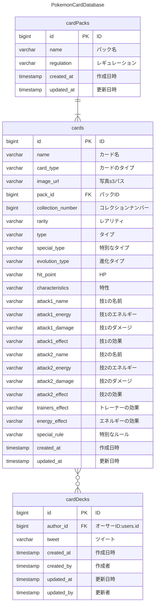

# A.2.要件定義書

## A.要件分析
- データベース作成において重要な事前決定事項を調べる
  - インデックス
  - 

## B.要件仕様の作成

### B.1.データベースの設計
ER図をMermaid記法で記す。

(参考:https://docusaurus.io/docs/markdown-features/diagrams,
https://mermaid.js.org/config/accessibility.html#entity-relationship-diagram)

ポケモンカードの見方は[このサイト](https://snkrdunk.com/articles/15397/)を参考にした。
sqlの型一覧 : https://qiita.com/shuhoyo/items/07d28cec6babe788051d#varcharnmax%E5%9E%8B
